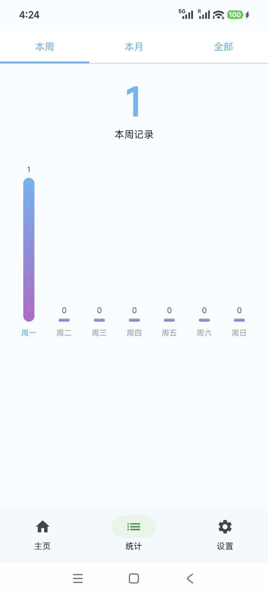
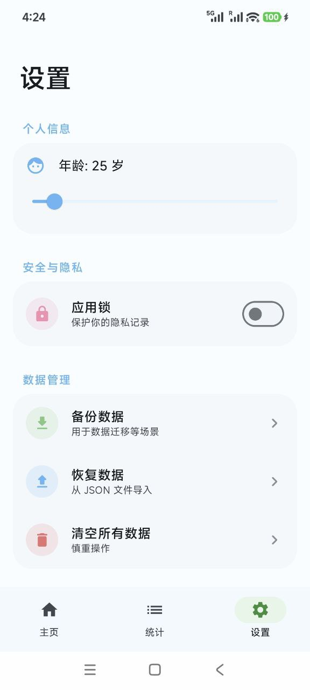

## 撸了么

帮助机长起飞的健康记录安卓APP。

## 功能特点
- 隐私安全：数据完全本地存储，无网络上传。
- 快捷记录：一键记录每日状态，支持撤销与补录。
- 数据统计：提供周视图和月度热力图，直观展示频率趋势。
- 健康建议：根据年龄和频率提供个性化健康提醒。
- 现代设计：基于 Material Design 3 的流畅动画与界面。

## 技术栈
- 语言：Kotlin
- UI 框架：Jetpack Compose
- 架构：MVVM, Hilt (依赖注入)
- 数据库：Room
- 图表：自定义 Compose 图表组件

## 预览图

